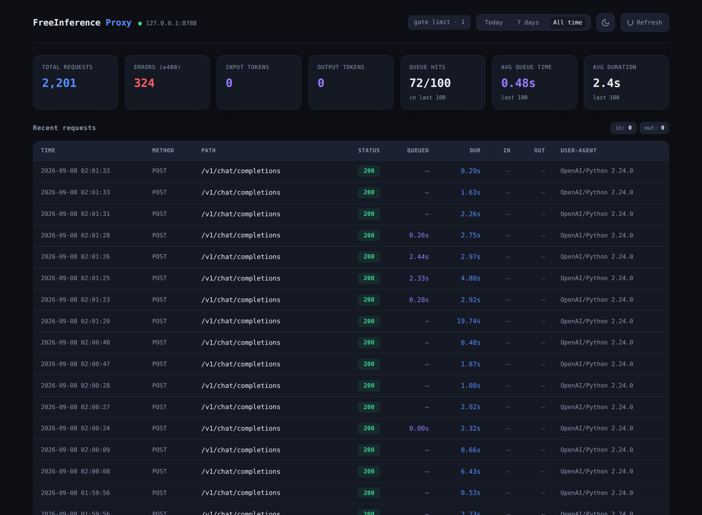

# FreeInference 1-concurrent request proxy

A local reverse proxy that caps FreeInference at one in-flight upstream request at a time and queues the rest.

Auto-generated text is boring. Here is the short version of why this exists.

## Why I built it

FreeInference's free tier lets you run 1 to 2 concurrent requests per account. I found this out the annoying way: a live `429 Too many concurrent requests (limit: 1)` from the upstream, and the community catalog agreeing with it.

The catch is that the agent I run (Hermes) never fires one request at a time. A single turn sends a main call plus vision and compression sub-calls plus delegation children, all at once. FreeInference sees that burst and answers `429`. The whole turn fails even though the model was ready to answer.

I did not want to throttle inside the agent, because every call site would need its own limiter and a new one appears every time I add a feature. One choke point in front of the provider does the same thing with a single implementation. Requests queue up behind it, one goes through at a time, and the burst never forms.

This proxy sits only in front of the FreeInference provider entry. Other providers connect directly and stay untouched.

## How it works

The proxy is a `ThreadingHTTPServer` on `127.0.0.1:8788`. Every request runs in its own thread. Two threads matter: the caller's thread and the upstream's.

1. **Read the body and headers.** Hop-by-hop headers (`Connection`, `Transfer-Encoding`, `Content-Encoding`, and friends) are stripped; everything else is forwarded.
2. **Acquire the gate.** A `threading.BoundedSemaphore(GATE_LIMIT)` with `GATE_LIMIT = 1`. `acquire(timeout=300)` blocks the thread. If it times out, the caller gets a local `429` with `Retry-After: 5`; nothing goes upstream.
3. **Forward.** `requests.request` sends the request to `freeinference.org`, streaming the response body. Streaming (`content-type: text/event-stream`) is relayed chunk-by-chunk with `Transfer-Encoding: chunked` so the caller sees tokens as they arrive. Non-streaming bodies (model lists, errors) are buffered and re-sent with a `Content-Length`.
4. **Release the gate.**

Each completed request is written to a SQLite row and one JSON line to the log file. `waited_s` is the time spent blocked on the gate; a nonzero value means it queued behind another request, which is the serialization working.

Three local read-only endpoints bypass the gate entirely and never count toward the concurrency limit: the dashboard HTML, the recent-requests JSON, and an SSE stream the dashboard subscribes to for live updates.

Concrete numbers that shape behaviour:

- `GATE_LIMIT = 1` — at most one request is upstream at any instant.
- `ACQUIRE_TIMEOUT = 300`s — a caller waits up to 5 minutes in the queue before it gives up with a local `429`.
- `READ_TIMEOUT = (30, 900)` — 30s to connect, 900s to finish. Long generations do not die to a read timeout.

## The dashboard

Because a one-at-a-time queue hides queued work, the proxy logs every request and serves a real-time dashboard on the same port. It is a single self-contained HTML file, dark theme, no build step, no dependencies, and it updates live over Server-Sent Events (no page refresh, no polling).

Read-only endpoints, all served locally and never counted against the upstream gate:

- `/__dashboard` the dashboard
- `/__api/requests?limit=N` the recent-requests JSON
- `/__api/events` the SSE stream



## Install

Python 3.9+ and `requests`.

```bash
pip install -r requirements.txt
# or from source
pip install .
```

Then run:

```bash
freeinference-serial-proxy
```

Defaults: listens on `127.0.0.1:8788`, forwards to `https://freeinference.org`, data written to `~/.local/share/freeinference-1-concurrent-proxy/`.

Point an OpenAI-compatible client at `http://127.0.0.1:8788`. Set the API key as you normally would for FreeInference; the proxy forwards it untouched.

Point your browser at `http://127.0.0.1:8788/__dashboard`.

## Options

```
--data-dir DIR    where the SQLite history and request log live
                  (default ~/.local/share/freeinference-1-concurrent-proxy)
--listen-host H   interface to bind (default 127.0.0.1)
--port P          listen port (default 8788)
--upstream URL    upstream base (default https://freeinference.org)
```

## Run as a service

`deploy/freeinference-serial-proxy.service` is a systemd user unit. Copy it to `~/.config/systemd/user/`, then:

```bash
systemctl --user daemon-reload
systemctl --user enable --now freeinference-serial-proxy
```

## Dashboard on another interface (optional)

The proxy binds `127.0.0.1` only, so it cannot listen on a network interface directly. If you want the dashboard reachable somewhere else (say on a Tailscale IP) without exposing the raw proxy API there, run the included bridge:

```bash
freeinference-dashboard-bridge --listen-host <your.ip> --port 8789 \
  --target-host 127.0.0.1 --target-port 8788
```

This forwards only `/__dashboard` and its `/__api/requests` fetch. The raw proxy stays localhost-only. It is pure standard library and is not required for the core proxy to work.

## What this is not

No TLS, no auth, no multi-account support. FreeInference caps concurrency per account, and this proxy assumes one account. If you need to spread load across accounts, this is the wrong tool. If you need to gate a single account locally, this is the whole job.

## License

MIT.